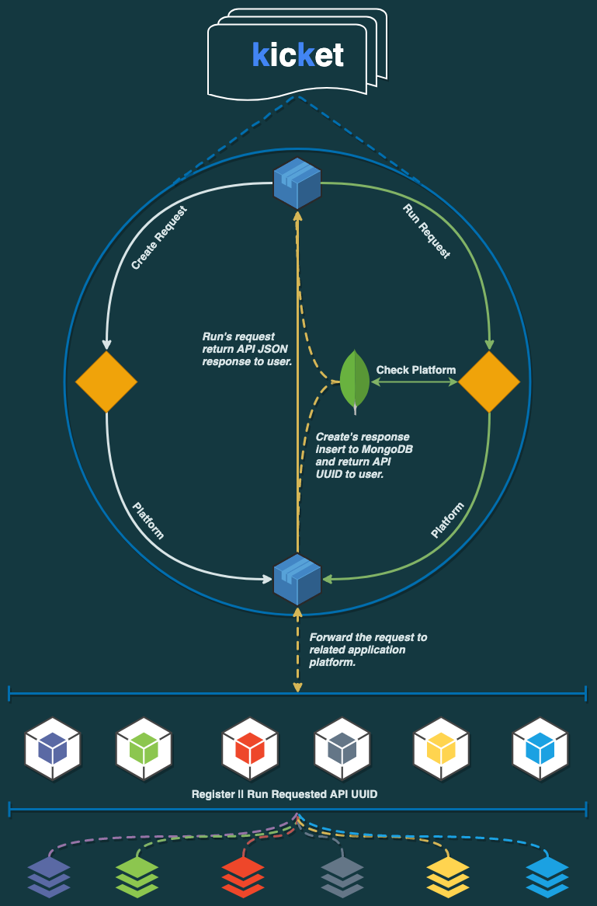

# Rest API Playground 

# Why we did that?

> Lorem ipsum dolor sit amet, consectetur adipiscing elit, sed do eiusmod tempor incididunt ut labore et dolore magna aliqua. Ut enim ad minim veniam, quis nostrud exercitation ullamco laboris nisi ut aliquip ex ea commodo consequat. Duis aute irure dolor in reprehenderit in voluptate velit esse cillum dolore eu fugiat nulla pariatur. Excepteur sint occaecat cupidatat non proident, sunt in culpa qui officia deserunt mollit anim id est laborum.

# What's happening on inside?

    

### Let's look at step by step;

> Scenario 1

> Scenario 2

### How can I build & run the project locally?

1. Just clone [kicket](https://github.com/gurkanakdeniz/kicket) repository.
   - Lorep ipsum

### Dependent projects

- [Java Repository](https://github.com/gurkanakdeniz/kicket-java)
- [Node JS Repository](https://github.com/ilkemerol/kicket-node)
- [HTML Repository](https://github.com/ilkemerol/kicket-html)
- [Pyhton Repository](https://github.com/gurkanakdeniz/kicket-python)
- [Golang Repository](https://github.com/gurkanakdeniz/kicket-go)
- [PHP Repository](https://github.com/gurkanakdeniz/kicket-go)